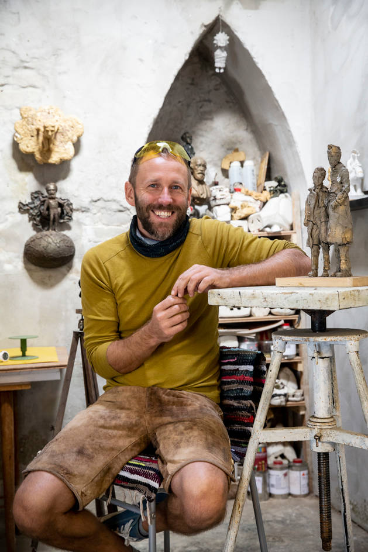

# Kolodko Mihály
## Bemutatkozás:

| Kolodko Mihály | |
| ----------- | ----------- |
| Állampolgársága: | <a href="https://hu.wikipedia.org/wiki/Szovjetuni%C3%B3">szovjet <a/>, <a href="https://hu.wikipedia.org/wiki/Ukrajna"> ukrán </a> |
| Született: | 1978 |
| Foglalkozása: | <a href="https://hu.wikipedia.org/wiki/Szobr%C3%A1szm%C5%B1v%C3%A9sz">szobrász |

Kolodko Mihály (ukránul: Михайло Іванович Колодко, latin betűkkel: Mihajlo Ivanovics Kolodko, említik még: Mihail Kolodko, Mykhailo Kolodko neveken is), (Ungvár, Ukrán SZSZK, 1978 –) ukrán-magyar szobrászművész.
                
    Kolodko véleménye szerint azok az idők már elmúltak,
    hogy egy szobor elkészítését központilag határozzák meg;
    teret kell engedni a művészek és az emberek érdeklődésének is.
    Így született meg például a 2010-ben Ungváron felállított
    Lámpagyújtogató szobor is, amely a város szülöttének, Kolja bácsinak alakját
    örökítette meg.
         
    A köztéri szobrok egy más dimenziója született meg azáltal,
    hogy rátalált a mostanában olyan sok embert érdeklő miniszobrok témájára,
    melyek szerinte ugyanolyan drámai erővel tudnak hatni a szemlélődőkre, 
    mint az óriási alkotások.
                
    Első apró alkotásai Ungvár utcáin jelentek meg, és eleinte vegyes
    fogadtatásra találtak; később, mikor már megszokottá váltak, az emberek
    megkedvelték őket. A kisméretű szobrok elkészítése onnan eredt, hogy a nagy
    méretben készülő szobrokat is először kis méretben kell elkészíteni.
                
    A művésznek nem mindig volt tervei megvalósításához megrendelője,
    és így anyagi fedezet híján, hogy ötletei ne vesszenek el, elkészítette
    őket kicsiben. Kolodko, amikor Budapestre költözött a családjával, 
    először is a Főkukac szobrát készítette el, ungvári elődje mintájára.
    A 15 cm-es szobrocska a Bem rakpart 15. számú ház előtt helyezkedik el
    a felső rakpart mellvédjén.
                
    Kolodko kedvenc gyermekkori mesefigurája kelt életre a kis szoborban:
    azt szerette volna, ha gyermekei is úgy tekintenek rá, mint ő gyermekkorában.
    Számára azért is volt fontos ez a mesesorozat, mert nézése közben tanulta meg a magyar nyelvet.
                
    Az apró szobrok hamar népszerűséget szereztek maguknak, olyannyira, hogy némelyiket többször is ellopták.
    Például a Mekk Elek szobornak már a második példánya van kint a téren;
    viccesen Mekk Elek 2.0-nak hívják a gerillaszoborként elhíresült alkotást.
                
    A gerillaszobrászat kifejezés onnan ered, hogy a szobrok engedély nélkül kerültek ki a közterekre,
    bár először nem is volt erre szabályzat.

 
