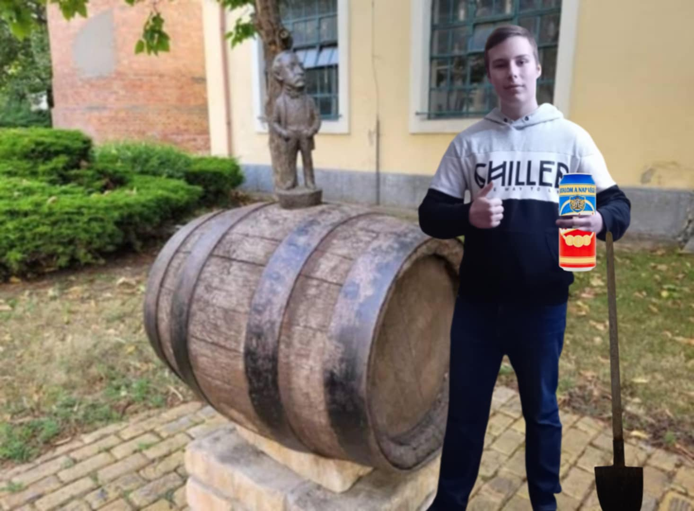

# 1. Söröslovak miniszobor

## Hol van?
Budapest, Dreher Antal út 3, 1106
## Képek

## Rövid leírás
A Kőbányai Serfőző Társaságot 1854-ben alapították, és mai is működik, mint Dreher Sörgyár. A sörfőzdét idősebb Dreher Antal virágoztatta, fel saját találmánya, a ma Vienna Lágerként ismert sör révén – az egyik szobor őt is ábrázolja. A családja kezében a Kőbányai Sörgyár hamarosan az ország legnagyobb sörgyára lett, amely tavaly ünnepelte 165 éves jubileumát.

A gyár előtt áll a szobor, amely egy valódi mészkőhídon áll és olyan söröskocsit ábrázol, amelyet két dreheres ló húz.

„A sörgyár hangulata és története azonnal megérintett, amikor bejárhattam pincétől a padlásig, láttam az Eiffel-iroda által tervezett „léhűtő” padlást, a 100 éves Zsolnai csempéket, a söröslovakat, a százéves hordókat. Azért pedig külön örültem a felkérésnek, mert így most már Kőbányán, Budapest mértani közepén is megjelenhetnek a szobraim” – mondta el a szobrokat megálmodó és elkészítő Kolodko Mihály.

## Nevezetességek a közelben
1. Dreher Sörmúzeum Budapest
2. Kőbányai sörgyár
---
# 2. Dreher Antal miniszobor

## Hol van?
Budapest, Dreher Antal út 3, 1105
## Képek

## Rövid leírás
A Dreher Sörgyárak előtt a söröskocsit húzó lovacskák szobra, a gyár udvarán, a műemlék ipari épületek között az alapító, id. Dreher Antal (1810-1863) szobra került felállításra.
A szobrocskát egy eredeti söröshordó tetején helyezték el. A kiváló helyválasztásnak köszönhetően, a felújított Főzőház tornyos épülete látható a háttérben.

A szobor sétapálcával ábrázolja az alapítót, amelyhez egy legenda is kötődik.
Dreher Antal annak idején Ausztriában, Münchenben és Angliában tanulta ki a szakma rejtelmeit. Az egyik angliai tanulmányútja során üreges sétapálcájába rejtette el a konkurencia sörmintáját, hogy Schwechatra hazatérve alaposan tanulmányozhassa.

Ami már nem legenda: 1840 körül bevezette az alsóerjesztésű sörtechnológiát és egy új sörtípust is kifejlesztett a Lagerbiert. Később ezért kapta a „Sörkirály” kitüntető rangot.

A kőbányai sörgyár vezetését 1862-ben vette át, amit folyamatosan fejlesztett egy évvel később bekövetkezett váratlan haláláig.
A gyárat fia, ifj. Dreher Antal 7 évvel később 21 éves korában vette át és folytatta a technológiai fejlesztéseket és a terjeszkedést.

## Nevezetességek a közelben
1. Dreher Sörmúzeum Budapest
2. Kőbányai sörgyár
---
# 3. A balta miniszobor

## Hol van?
Budapest, Szabadság tér 15, 1054

## Képek

## Rövid leírás
A Balta miniszobor nem más, mint Kolodko Mihály frappáns válasza a rongálásra. Elkészítésénél azt a „gyilkos” fejszét vette alapul, amellyel kiebrudalták az Usánkát. Elődjére emlékét pedig azzal őrzi, hogy egy hasonló bronzpárnához erősítették.

Egy usánkát ábrázolt díszpárnán az a miniszobor, amelyet Kolodko Mihály gerillaművész a Duna-parton helyezett el november végén. Az alkotás hamarosan forró vitát generált, amelynek kétségtelenül csúcspontja volt Fülöp Erik önjelölt performanszművész markos megmozdulása, aki baltával szedte le a helyéről az usánkát, majd hajította a Dunába. Az ország így megmenekült a pár centis bronzdarab fenyegetésétől.

De nem sokáig.

## Nevezetességek a közelben
1. Szabadság tér
2. Szovjet hősi emlékmű

---

# 4. Holdjáró miniszobor

## Hol van?
Budapest, Hold utca 12, 1054

## Képek

## Rövid leírás

Mihail Kolodko (Kolodkó Mihály) ukrán-magyar szobrászművész, aki apró szobrairől ismert, melyekkel számtalan helyen találkozhatunk a városban.
A Hold utcában, néhány lépésre a Batthyányi-örökmécsestől található Kolodko holdjáró miniszobra. A bronz alkotás egy gömb alakú térelem felületén robog, benne pedig egy integető asztronauta köszönti a járókelőket.
A magyar származású, NASA-díjas amerikai mérnök, Pavlics Ferenc előtt tiszteleg a miniszobor, aki a világon elsőként hozott létre olyan holdjárművet, ami a távoli égitest felszínén is üzemképes maradt.

## Nevezetességek a közelben
1. atthyány Lajos-örökmécses
2. Emléktábla az aradi vértanúkról

---

# 5. Usánka visszatér miniszobor

## Hol van?
Budapest, Id. Antall József rkp., 1055

## Képek

## Rövid leírás

2019 novemberében szomorú véget ért Kolodko Mihály egyik miniszobra, a gerillaszobrásznak a Szabadság téren felállított, usánkát formázó alkotását Fülöp Erik, a Mi Hazánk országgyűlési képviselője baltával verte le, majd a Dunába dobta.

A politikus azzal indokolta tettét, hogy önkényuralmi jelképet látott az aprócska figurában. Kolodko hamar reagált a történtekre, néhány hónappal később új szobor jelent meg a régi helyén, amelynek díszpárnáján már nem a korábban megformázott usánka, hanem a „szobordöntés” eszköze, a balta foglalt helyet.

Időközben azonban kiderült, hogy az usánka sem adta át magát a teljes megsemmisülésnek, hanem alkalmazkodott a vizes körülményekhez békalábat növesztett, mostanra pedig visszamászott a partra, és a Parlament előtti rakpart lépcsőjén szárogatja magát.

Remélhetőleg ezúttal arra is képes lesz, hogy elugráljon a rosszakarói elől.

## Nevezetességek a közelben
1. Országház
2. Kossuth Lajos tér

---

# 6. Drakula miniszobor

## Hol van?
Budapest, Kós Károly stny. 1, 1146

## Képek

## Rövid leírás

Kolodko Drakula szobránál sokat morfondíroztunk, vajon miért került a Vajdahunyad várához. Már a Kolodko szobor előtt is vaciláltunk, ugyanis van még egy Drakula mellszobor, ami 2003-ban került oda, egyébként nem messze Kolodko Drakulájától. A vacilálásunk oka az, hogy Drakula gróf, azaz az életben Vlad Tepes hírhedt havasalföldi vajda törcsvári. És nem vajdahunyadi. Mindkét város vára Erdélyben található, sőt, a világhírűvé vált Drakula film főszereplője, Drakula gróf is erdélyi, Lugosi Bélának hívták (egyike azon magyaroknak, akik csillagot kaptak a hollywoodi hírességek sétányán). Szóval ez jó, szuper, hogy van egy világhírű sztorink, világhírű színésszel.

Aztán azt is érdemes tudni, hogy a magyarországi Vajdahunyad vára bizony nem az erdélyi Vajdahunyad Várának a másolata. Hanem egy építészzseni, Alpár Ignác műve, aki a történelmi Magyarország legjelentősebb épületeinek formáit (pl. a Hunyadi család Vajdahunyadban található várának részlete, a segesvári Apostol-torony részlete, a jáki és lébényi templom részlete, brassói Katalin bástya részlete, stb.) ötvözte egybe, itt Budapesten, az 1896-os Millenniumra.

## Nevezetességek a közelben
1. Vajdahunyad vára
2. Városliget
---

# 7. Sztálin csizmája miniszobor

## Hol van?
Budapest, Dózsa György út 35, 1146

## Képek

## Rövid leírás

A Néprajzi Múzeum Hősök tere felőli oldalán lévő padkán helyezte el Kolodko Mihály legújabb szobrát, melynek az AMONG US (vagyis a ’Közöttünk’) címet adta. A miniszobor a ledöntött Sztálin-szobor csizmáit ábrázolja (a kilógó csontokkal), és egy gördeszkát. A szobor az Ötvenhatosok terére került, egykor ugyanis itt állt az a Sztálin-szobor, melyből az 1956-os forradalom során történt ledöntése után csak a két csizma maradt ott. Emiatt az egykori Sztálin teret pár napig „Csizma térnek” is hívták. A gördeszka pedig valószínűleg arra utal, hogy a nemrégiben átadott múzeum egy óriási gördeszkapályára hasonlít.

## Nevezetességek a közelben
1. Néprajzi Múzeum
2. Hősök tere
---

# 8. Micimackó miniszobor

## Hol van?
Budapest, Damjanich u. 27, 1071

## Képek

## Rövid leírás

A szobor Kolodko Mihály stílusának és a magyar irodalom iránti tiszteletének egyedülálló megjelenése, amely a gyermekirodalom kedvelt alakját, Micimackót örökíti meg. A figura kifejező arca és a mézescsupor, melyet a medve a kezében tart, egyaránt utalnak a szeretetteljes és naiv világra, amelyet a mese képvisel. A Damjanich utca ezen szeglete így egy fontos kulturális helyszínné vált, mely összeköti a múltat a jelennel, és emléket állít Karinthy fordítói munkásságának. A szobor nemcsak a gyermekek számára ad üzenetet, hanem a felnőtteknek is, akik felfedezhetik benne a mélyebb, ironikusabb rétegeket, melyeket Karinthy mesterien belecsempészett a mese fordításába. A műalkotás a városkép szerves részévé vált, és egyedülálló módon tükrözi a magyar irodalom hagyományait, miközben az idő múlásával új generációkat is megszólít.

## Nevezetességek a közelben
1. Városligeti Nagyjátszótér
2. Bajza utca
---

# 9. Noé bárkája miniszobor

## Hol van?
Budapest, Bethlen Gábor tér, 1071

## Képek

## Rövid leírás

Kolodko Mihály szobrai általában mélyebb, filozófiai üzenetet hordoznak, miközben a közönség számára játékos, szórakoztató formában jelennek meg. A Noé bárkája miniszobor nemcsak vallási szimbolikát, hanem az állatok védelmét és a természet iránti tiszteletet is hirdeti, ami különösen aktuális üzenet a mai világban. A szivárvány, mint a remény szimbóluma, az emberek és az állatok közötti összhangot is sugallja, utalva arra, hogy mindkét fajnak fontos szerepe van a Föld megóvásában. A kis szobor elhelyezése a közterületen lehetőséget ad arra, hogy a járókelők egy pillanatra megálljanak és elgondolkodjanak a környezetvédelem fontosságáról, miközben a művészet szépségét is élvezhetik. Kolodko művei általában interaktívak, így a Noé bárkája is meghívja a nézőt, hogy elmélyedjen a szobor mögötti történetben és felfedezze annak részleteit, miközben a város egy eldugott, de szép szegletében talál rá.

## Nevezetességek a közelben
1. Állatorvostudományi Egyetem
2. Keleti pályaudvar
---

# 10. Garfield miniszobor

## Hol van?
Budapest, Dembinszky u. 4-sz. szemben, 1071

## Képek

## Rövid leírás

Kolodko Mihály, akit a főváros közterületein elhelyezett apró alkotásairól ismert meg a város, majd az egész ország, egyébként nem szereti, ha miniszobroknak nevezik a műveit, ő mini emlékműveknek tekinti őket. Bár szakmai berkekben megoszlanak a vélemények a munkáiról (Pólya Zsombor képzőművész például bedobozolta Kolodko Dunakorzón felállított, Roskovics Ignác festőt ábrázoló szobrát), az emberek többsége szereti a város különböző pontjain elhelyezett alkotásokat, és a turisták is rendszeresen fotózkodnak velük. 46 évvel ezelőtt, 1978. június 19-én jelent meg először Jim Davis alkotásában az első, pár képből álló Garfield-képregény az újságokban – a jeles dátum alkalmából Koldoko Mihály szobrászművész pedig most Garfield figuráját dobta fel Budapest VII. kerületének egyik pontjára.

## Nevezetességek a közelben
1. Állatorvostudományi Egyetem
2. Keleti pályaudvar
---

# 11. A tizennégy karátos autó miniszobor

## Hol van?
Budapest, Hevesi Sándor tér, 1077

## Képek

## Rövid leírás

A tizennégy karátos autó szobra 2019 nyarán foglalta el helyét Budapest VII. kerületében, a Hevesi Sándor téren. Készítője nem más, mint Kolodko Mihály, aki miniatűr szobraival az egész országot szerelembe ejtette. A legendás jármű 2019. augusztus 27-én lett elhelyezve a Magyar Színház bejáratával szemben, a Folyamat című alkotás jobb oldalán. Ahogy azt Kolodko Mihálytól már megszokhattuk, a helyválasztás sem véletlen, hiszen itt található Rejtő Jenő szülőháza is. Ő volt a 20. század regényíró óriása, a szobor pedig egyik legismertebb művénekű, A tizennégy karátos autónak állít emléket.

## Nevezetességek a közelben
1. Magyar színház
2. Rózsák tere
---

# 12. A búvár és a kulcs miniszobor

## Hol van?
Budapest, Dohány u. 53, 1074

## Képek

## Rövid leírás

Bemutatkozás Kolodko Mihály Búvár és a kulcs miniszobra a New York Palota közelében található. A piciny bronzfigura egy tűzcsap tetején ül, és őrzi a mellette lévő kulcsot, amely a New York Kávéházat nyitja.

Kolodko: Búvár és a kulcs miniszobor 1894. október 23-án nyílt meg a kávéház a New York Palota földszintjén. A monda szerint a nyitás napján egy újságíró, Molnár Ferenc a kávézó kulcsát a Dunába dobta azért, hogy az mindig nyitva álljon a vendégek előtt. Egy másik történet szerint a kávéházat 1927-ben nyitották meg újra egy felújítást követően. Molnár Ferenc ekkor is a Dunába dobta a kulcsot.

A New York Kávéház 2014-ben ünnepelte 120. születésnapját. Az évforduló alkalmából a vezetőség a Dunába dobta a kulcsot, hogy minimum még 120 évig be tudjanak térni a vendégek egy kávéra. Ehhez a történethez kapcsolódik a búvár, aki megkereste a Dunába dobott kulcsot, elhozta magával és őrzi a tűzcsap tetején, hogy ne dobják többé a Dunába.

## Nevezetességek a közelben
1. Blaha Lujza tér
2. Lidl
---

# FORRÁSOK

https://www.kozterkep.hu/41018/soroslovak

https://www.kozterkep.hu/41032/dreher-antal

https://www.errearra.org/kolodko-balta

https://www.errearra.org/kolodko-holdjaro

https://welovebudapest.com/cikk/2023/05/09/latnivalok-es-kultura-kolodko-szobor-usankas-beka-parlament-miniszobor/

https://www.errearra.org/kolodko-drakula

https://welovebudapest.com/cikk/2022/10/23/latnivalok-es-kultura-uj-kolodko-szobor-neprajzi-muzeum-mellett-sztalin-csizma-1956/

https://www.kozterkep.hu/47690/micimacko

https://szallas.hu/programok/kolodko:-noe-barkaja-miniszobor-budapest-p9021

https://www.errearra.org/kolodko-garfield

https://www.kozterkep.hu/38742/a-tizennegy-karatos-auto

https://szallas.hu/programok/kolodko:-buvar-es-a-kulcs-miniszobor-budapest-p9012
